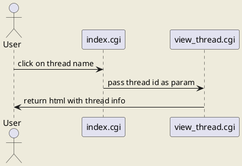
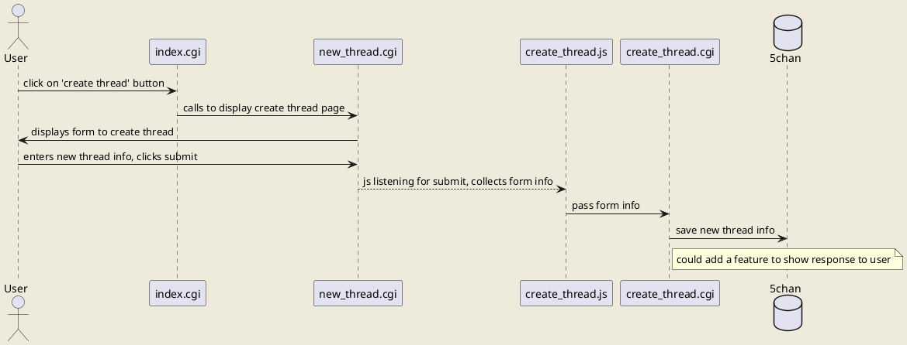

# 5chan Architecture

## Revision History

| Date | Description | Author
| --- | --- | --- |
| 20201-02-27 | Init | Mush |

## Table of Contents

1. Introduction
  - 1.1 Purpose
  - 1.2 Scope
  - 1.3 Definitions, Acronyms
  - 1.4 References

2. Architectural Representation

3. Architectural Goals and Constraints

4. Use-Case View

5. Logical View

6. Process View

7. Deployment View

8. Size and Performance

99. The rest is here: https://www.ecs.csun.edu/~rlingard/COMP684/Example2SoftArch.htm

## Software Architecture Document

### 1. Introduction

#### 1.1 Purpose

This document is for covering the details on what 5chan is, and will be.
It will go over use cases, and the features that will be built around them.   

#### 1.2 Scope

The document will cover basic use cases and the interactions and flow of data for each of these use cases.  
It will most likely not go over too much about performance. 

### 2. Architectural Representation

### 3. Architectural Goals and Constraints

### 4. Use-Case View

- Login
- View threads (index)
- View thread

- Create thread

- Comment on thread

### 5. Logical View

### 6. Process View

### 7. Deployment View

### 8. Size and Performance
